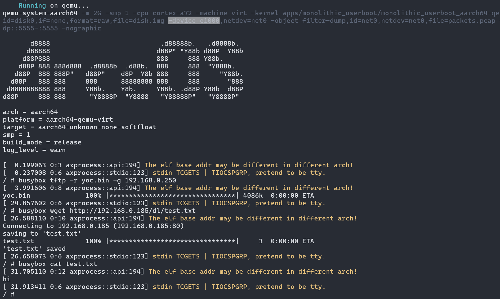
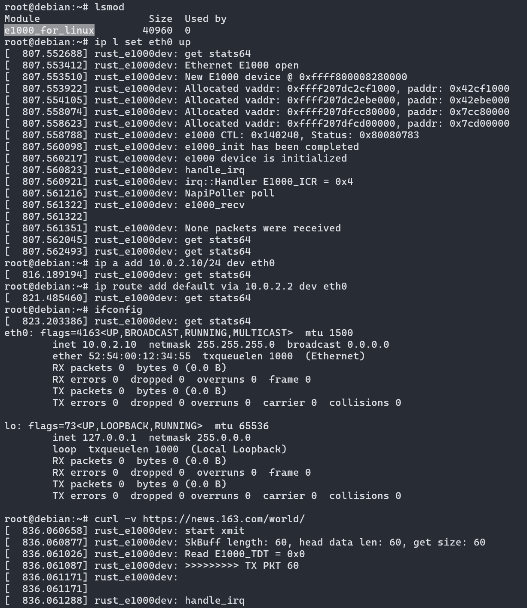

# E1000 Driver
E1000 driver in Rust for the Intel 82540EP/EM and 82574L Gigabit Ethernet.

## Support features
* `e1000` and `e1000e` driver on Qemu and [a Physical Industrial Computer](doc/E1000E驱动移植于工控机的技术总结及网卡性能测试.pdf) are supported
* Initialize simple PCI-Express for e1000 device
* Implement the e1000 driver as a linux driver module

- _Todo: networking protocol support: IP, ARP, UDP_

## Quick start on bare metal OS

For instance, [E1000 driver in Rust on ArceOS/Starry](https://github.com/elliott10/arceos/blob/net-e1000/crates/driver_net/src/e1000.rs)



Initialize PCI and E1000 driver
```
pub struct Kernfn;
impl e1000_driver::e1000::KernelFunc for Kernfn { ... }

e1000_driver::pci::pci_init();

let mut e1000_device = e1000_driver::e1000::E1000Device::<Kernfn>::new(e1000_driver::pci::E1000_REGS as usize).unwrap();
```

Sending network packets
```
e1000_device.e1000_transmit(&frame);
```

Receiving network packets
```
let rx_buf = e1000_device.e1000_recv();
```

## Rust e1000 driver for Linux kernel module

```
cd src/linux
make ARCH=<cpu arch> KDIR=<path to linux>
# e.g. make ARCH=x86_64 KDIR=/home/rust/linux/build
```

* `e1000-driver` runs on Linux



* Performance test results on Linux

```
root@debian:~/xly# ip a
1: lo: <LOOPBACK,UP,LOWER_UP> mtu 65536 qdisc noqueue state UNKNOWN group default qlen 1000
    link/loopback 00:00:00:00:00:00 brd 00:00:00:00:00:00
    inet 127.0.0.1/8 scope host lo
       valid_lft forever preferred_lft forever
    inet6 ::1/128 scope host noprefixroute
       valid_lft forever preferred_lft forever
2: sit0@NONE: <NOARP> mtu 1480 qdisc noop state DOWN group default qlen 1000
    link/sit 0.0.0.0 brd 0.0.0.0
4: eth0: <BROADCAST,MULTICAST,UP,LOWER_UP> mtu 1500 qdisc pfifo_fast state UP group default qlen 1000
    link/ether 52:54:00:12:34:56 brd ff:ff:ff:ff:ff:ff
    inet 10.0.2.10/24 scope global eth0
       valid_lft forever preferred_lft forever
    inet6 fe80::5054:ff:fe12:3456/64 scope link proto kernel_ll
       valid_lft forever preferred_lft forever
root@debian:~/xly# iperf3 -c 192.168.0.250 -p 8880 -b 100M -P 1 -t 5
Connecting to host 192.168.0.250, port 8880
[  5] local 10.0.2.10 port 50338 connected to 192.168.0.250 port 8880
[ ID] Interval           Transfer     Bitrate         Retr  Cwnd
[  5]   0.00-1.00   sec  11.9 MBytes  99.4 Mbits/sec    0    177 KBytes
[  5]   1.00-2.00   sec  12.0 MBytes   101 Mbits/sec    0    177 KBytes
[  5]   2.00-3.00   sec  11.9 MBytes  99.6 Mbits/sec    0    177 KBytes
[  5]   3.00-4.00   sec  11.9 MBytes  99.6 Mbits/sec    0    177 KBytes
[  5]   4.00-5.00   sec  12.0 MBytes   101 Mbits/sec    0    177 KBytes
- - - - - - - - - - - - - - - - - - - - - - - - -
[ ID] Interval           Transfer     Bitrate         Retr
[  5]   0.00-5.00   sec  59.6 MBytes   100 Mbits/sec    0             sender
[  5]   0.00-5.00   sec  59.6 MBytes   100 Mbits/sec                  receiver

iperf Done.
root@debian:~/xly# iperf3 -u -c 192.168.0.250 -p 8880 -b 100M -P 1 -t 5
Connecting to host 192.168.0.250, port 8880
[  5] local 10.0.2.10 port 44234 connected to 192.168.0.250 port 8880
[ ID] Interval           Transfer     Bitrate         Total Datagrams
[  5]   0.00-1.00   sec  11.9 MBytes  99.9 Mbits/sec  8556
[  5]   1.00-2.00   sec  11.9 MBytes   100 Mbits/sec  8562
[  5]   2.00-3.00   sec  11.9 MBytes   100 Mbits/sec  8562
[  5]   3.00-4.00   sec  11.9 MBytes   100 Mbits/sec  8562
[  5]   4.00-5.00   sec  11.9 MBytes   100 Mbits/sec  8561
- - - - - - - - - - - - - - - - - - - - - - - - -
[ ID] Interval           Transfer     Bitrate         Jitter    Lost/Total Datagrams
[  5]   0.00-5.00   sec  59.6 MBytes   100 Mbits/sec  0.000 ms  0/42803 (0%)  sender
[  5]   0.00-5.04   sec  59.6 MBytes  99.1 Mbits/sec  0.002 ms  0/42803 (0%)  receiver

iperf Done.
root@debian:~/xly# ping 10.0.2.2
PING 10.0.2.2 (10.0.2.2) 56(84) bytes of data.
64 bytes from 10.0.2.2: icmp_seq=1 ttl=255 time=0.149 ms
64 bytes from 10.0.2.2: icmp_seq=2 ttl=255 time=0.256 ms
64 bytes from 10.0.2.2: icmp_seq=3 ttl=255 time=0.193 ms
64 bytes from 10.0.2.2: icmp_seq=4 ttl=255 time=0.190 ms
^C
--- 10.0.2.2 ping statistics ---
4 packets transmitted, 4 received, 0% packet loss, time 3054ms
rtt min/avg/max/mdev = 0.149/0.197/0.256/0.038 ms
root@debian:~/xly# lsmod
Module                  Size  Used by
e1000_for_linux        45056  0
root@debian:~/xly# uname -a
L
```

## Reference
* Linux source code
* [xv6: Implementation of net](https://github.com/mit-pdos/xv6-riscv-fall19/tree/net)
* [MIT 6.828/2019/networking](https://pdos.csail.mit.edu/6.828/2019/lec/l-networking.pdf)
* [Intel Gigabit Ethernet 82540EP/EM](https://pdos.csail.mit.edu/6.828/2019/readings/hardware/8254x_GBe_SDM.pdf)
* [OSDev: Intel 8254x](https://wiki.osdev.org/Intel_8254x)
* [Rust for Linux](https://github.com/fujita/linux/tree/rust-e1000)
* [Kernel threads: Rust e1000 driver (Intel Ethernet adapter)](https://lore.kernel.org/rust-for-linux/20220919.103820.680182888079022491.fujita@lima-default/)
